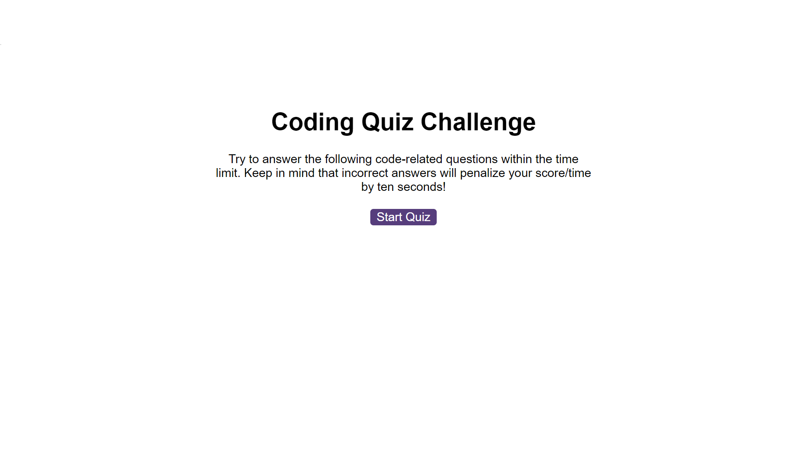
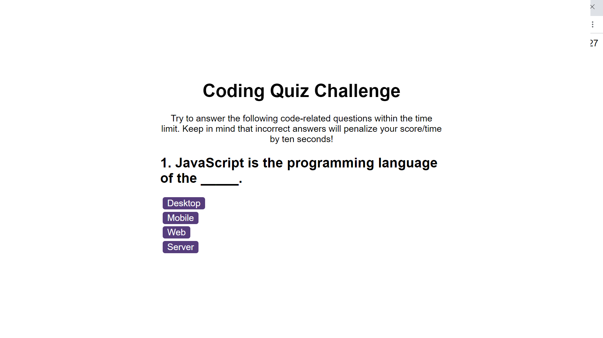
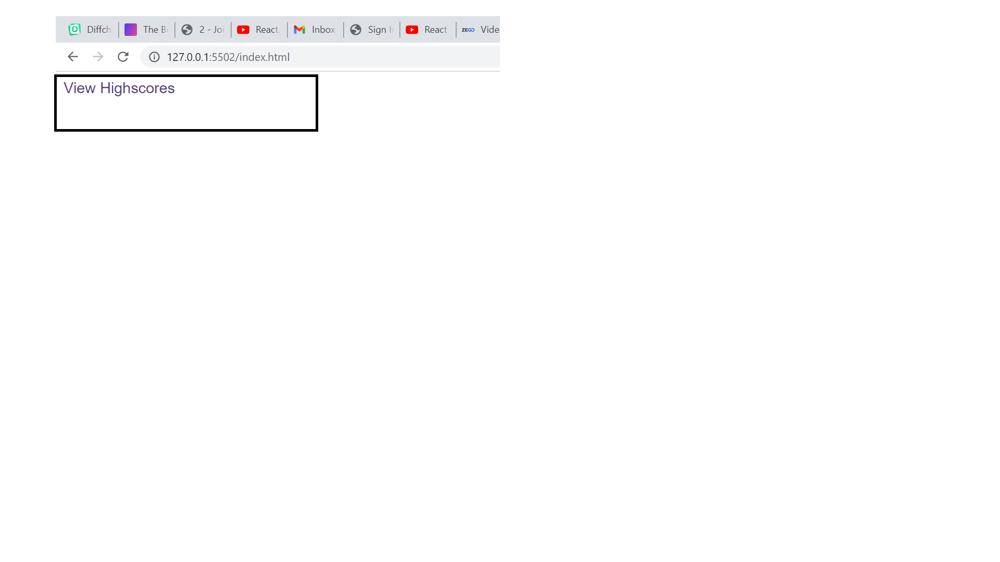

# coding_quiz_game

This application is designed to help student who are sitting for coding interview. it is used designed in such a way that the student will not need anyone to monitor their time during the exam and also it has the ability to summate the total score of every person sitting for the quiz

## Functionality

This app is made up questions with multiple choice options for each questions and quite interactiove with the ability to save the highest score you had after every section to clear the history if you wish to do away with the first set of questions

## How to Use the app

### First Page

The above is the first image you will see and it gives you the oppurtunity to start a new session

### Question Page

The above shows how the question will appear and while awaiting you to click the correct answer, it will the save your score while at same time your time is moving

### Highscore

By the right hand side of the page, you will see the highscore text link to take you to the page for displaying the retrieved scores

### Timer

The time by the left hand are used to monitor time spent answering questions, it automatically starts counting down once the sessions starts

## Copywrights

code from obigabit with support from tutors and group mates. Was submitted before but due to poor marks, it was resubmitted after copying the first code and refacored it
